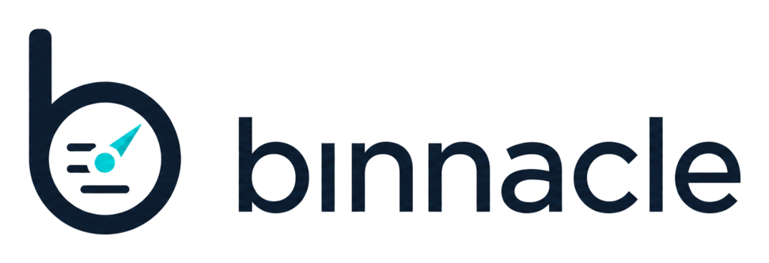

# Binnacle

> Lightweight, Coolify-aware monitoring for Docker servers.

Binnacle is an AGPL-3.0-only, self-hosted monitoring dashboard for Linux servers
running Docker workloads. It is designed for developers and small teams that
want host and logical-service visibility, local metric history, and a small
operational footprint without running a separate observability stack.

## Alpha status

The repository is implementing `v0.1.0-alpha.1`. The alpha scope is limited
to single-server Linux/Docker monitoring, including Coolify/Compose-aware
resource grouping, local SQLite history, live updates, and one local admin.
Notifications, health checks, logs, multi-server operation, and Docker
workload controls are not part of this release.

Binnacle is permanently read-only with respect to monitored hosts and Docker
workloads. It does not restart, stop, delete, exec into, or redeploy
containers. The Docker socket remains privileged even when mounted read-only;
see the security documentation before deployment.

## Product guarantees

- **Local-first:** core monitoring works offline and sends no telemetry by
  default.
- **Low overhead:** Go, SQLite, embedded frontend assets, and bounded
  collection/persistence work are the intended production architecture.
- **Coolify-first, Docker-compatible:** Coolify metadata improves grouping,
  but ordinary Docker and Compose deployments remain supported.
- **Single server first:** federation and agents are explicitly deferred.

## Supported alpha target

The supported deployment path is a Coolify-managed Docker service, with
Docker Compose as the portable alternative. Alpha targets Ubuntu 22.04/24.04
and Debian 12/13 on amd64 or arm64 with Docker Engine 24 or newer. Kubernetes,
Podman, non-Linux hosts, and Docker workload management are out of scope.

## Project documentation

- [Product and technical specification](docs/SPEC.md)
- [Implementation backlog](docs/TASKS.md)
- [Contributing guide](CONTRIBUTING.md)
- [Security policy](SECURITY.md)
- [Governance and ADR process](GOVERNANCE.md)
- [Project notice](NOTICE)

## License

Binnacle is licensed under [AGPL-3.0-only](LICENSE). If you modify Binnacle and
make the modified version available for users to interact with over a network,
the AGPL requires you to offer those users the corresponding source code.

The software license does not grant rights to the Binnacle name or logo.
Naming and trademark policy will be documented before a stable release.
